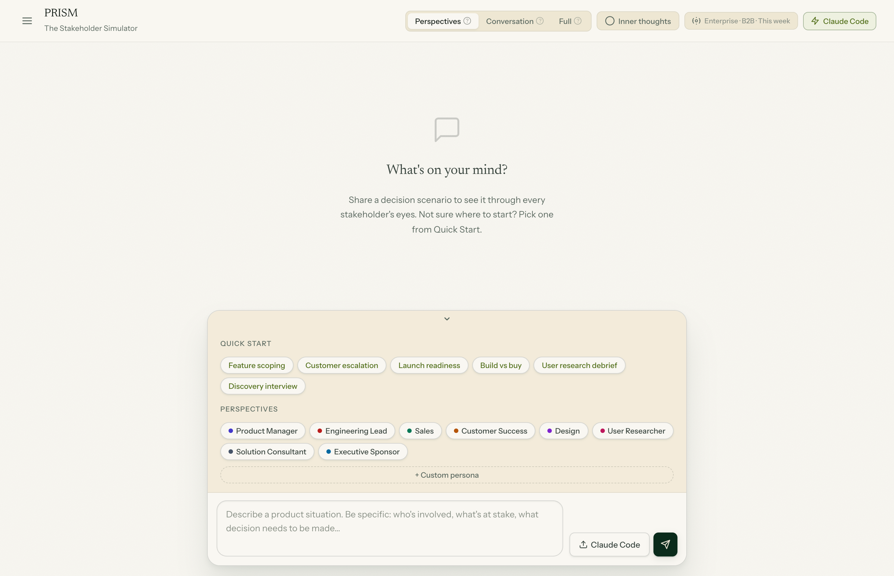

# PRISM — The Stakeholder Simulator

See every decision through every stakeholder's eyes. Paste a scenario and get perspectives from 8 organizational roles — instantly, with no API key required. Optionally connect Claude, OpenAI, or a local Ollama model for LLM-generated output.



---

## What it does

You describe a product situation — a feature cut, a customer escalation, a launch decision — and PRISM generates:

- **Individual perspectives** from each stakeholder: what they're thinking, their strategic concern, and a concrete recommendation
- **A simulated conversation** between stakeholders, including inner monologue (what they're thinking but not saying)

It's useful for anticipating objections before a meeting, pressure-testing a plan from multiple angles, or onboarding people to how different functions see a problem.

---

## Personas

Eight built-in organizational archetypes:

| ID | Name | Role |
|----|------|------|
| `pm` | Product Manager | Release Owner |
| `eng` | Engineering Lead | Platform Team |
| `sales` | Sales | Enterprise Account Executive |
| `cs` | Customer Success | Strategic Accounts Manager |
| `design` | Design | Product Designer |
| `uxr` | User Researcher | Research Lead |
| `sc` | Solution Consultant | Pre-Sales Technical |
| `exec` | Executive Sponsor | VP of Product |

Each archetype has distinct concerns, vocabulary, dialogue openers, and inner thoughts. You can also create custom personas with a name, role, and color.

---

## Generation modes

| Mode | What you get |
|------|-------------|
| **Perspectives** | Split-panel cards — each stakeholder's individual take |
| **Conversation** | Simulated meeting — stakeholders respond in sequence |
| **Full** | Both, in order |

---

## Company context

Set your company stage (Seed → Enterprise), market (B2B / B2C / B2B2C), and deadline pressure to shape how each stakeholder frames the problem. A Series A B2B startup under a tight deadline gets different responses than a large enterprise with no rush.

---

## Getting started

**Requirements:** Python 3.11+

```bash
git clone https://github.com/your-username/prism
cd prism

python -m venv .venv
source .venv/bin/activate   # Windows: .venv\Scripts\activate
pip install -r requirements.txt

python server.py
```

Open [http://127.0.0.1:8000](http://127.0.0.1:8000).

No build step. No database. Scenarios are saved as JSON files in `scenarios/`.

---

## LLM providers

By default, generation uses deterministic string templates — fast, offline, and zero cost. Click the lightning bolt icon in the toolbar to switch providers.

### Claude API
Enter your [Anthropic API key](https://console.anthropic.com). Uses `claude-opus-4-6`.

### OpenAI
Enter your OpenAI API key. Choose from `gpt-4o`, `gpt-4o-mini`, or `gpt-4-turbo`.

### Ollama (local models)
Run [Ollama](https://ollama.com) locally, click **Refresh** to load your installed models, and generate without any API cost or data leaving your machine.

```bash
ollama pull llama3
ollama serve
```

### Claude Code bridge
If you have [Claude Code](https://claude.ai/code) installed, the server automatically picks up queue items and runs them through the `claude` CLI. Click **Claude Code** in the input bar to queue a scenario — it appears in the sidebar within a few seconds.

Settings (API keys, provider choice) are stored in `localStorage` only and sent to the server via a request header. Keys are never written to disk.

---

## Architecture

```
server.py          FastAPI app — routes, WebSocket, file watcher, queue processor
templates.py       Deterministic stakeholder engine — no LLM
llm.py             LLM provider abstraction (Claude, OpenAI, Ollama, Claude Code)
static/
  app.js           Frontend state, WebSocket client, rendering
  index.html       UI structure
  style.css        Design system
scenarios/         Persisted scenario JSON files
scenarios/.queue/  Queue directory for Claude Code bridge
```

**How streaming works:** Generation writes a scenario JSON file incrementally in three phases — metadata, then perspectives one by one, then dialogue turns. A `watchdog` file watcher detects each write and broadcasts diffs over WebSocket. The frontend renders each chunk as it arrives with no polling.

### Scenario JSON shape

```json
{
  "id": "scenario_1234567890",
  "title": "...",
  "scenario": "...",
  "mode": "split | dialogue | both",
  "personas": [{ "id": "pm", "name": "Product Manager", "role": "Release Owner", "color": "#4338ca", "avatar": "PM" }],
  "perspectives": [{ "persona_id": "pm", "thinking": "...", "tag_label": "Strategy", "tag_content": "..." }],
  "dialogue": [{ "persona_id": "pm", "said": "...", "thought": "..." }]
}
```

---

## Stack

- **Backend:** Python, FastAPI, watchdog, uvicorn
- **Frontend:** Vanilla JS, no framework
- **Storage:** JSON files (no database)
- **LLM SDKs:** anthropic, openai, httpx (all optional)

---

## License

MIT
